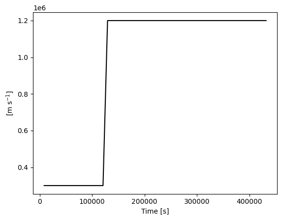

# EPREM(py)

Tools for working with EPREM simulation runs

## Installation

```bash
$ pip install eprempy
```

## Usage

Before getting started in earnest with `eprempy`, one simple task you can perform to make sure everything is installed is to print the version number.

```python
>>> import eprempy
>>> print(eprempy.__version__)
```

You can also print the version number via the package command-line interface (CLI)

```shell
$ python -m eprempy --version
```

The value printed will depend on which version you have installed.

### Creating an observer

The examples below assume a working knowledge of [EPREM](https://github.com/myoung-space-science/eprem) &mdash; essentially, they assume that you have successfully run EPREM and have access to both the runtime configuration file and the output files.

The most common first step will be to create a stream observer.


```python
from eprempy import eprem

stream = eprem.stream(4, source='data/with-dist/')
```

Each observer knows the path to the directory containing its dataset.


```python
stream.source
```


    PosixPath('/home/matthew/emmrem/open/source/eprempy/tests/data/isotropic-shock-with-dist')


Each observer knows the name of the file containing its dataset.


```python
stream.dataset.source.name
```


    'obs000004.nc'


The observer's `source` property is simply an alias for the path to the directory containing its dataset.


```python
stream.source == stream.dataset.source.parent
```


    True


```python
stream.dataset.source == stream.source / stream.dataset.source.name
```


    True


Each observer knows the name of the simulation configuration file that generated its dataset. Similar relationship hold between the `source` property and the path to this file.


```python
stream.config.source.name
```


    'eprem.cfg'


```python
stream.config.source == stream.source / stream.config.source.name
```


    True


Each observer knows the metric system in which it will compute physical quantities. The default metric system is MKS.


```python
stream.system
```


    System(mks)


If you are working in the directory containing the simulation output and the configuration file, assuming that file has a standard name, the only required information when creating a stream observer is the stream number.
```python
>>> stream = eprem.stream(4)
```

The `source` argument is required if you are not in the simulation output directory and the `config` argument is required if the corresponding configuration file has a non-standard name. Standard configuration-file names and patterns are

* `eprem_input_file`
* `*.cfg`
* `*.ini`
* `*.in`

Furthermore, creating an observer that uses the CGS metric system requires passing `system='cgs'`. Note that the `system` argument is not case-sensitive.

Of course, explicitly specifying each of these arguments is always safest!
```python
>>> stream = eprem.stream(4, source='data/with-dist', config='eprem.cfg', system='mks')
```

### Working with Simulation Data

You can print the names of available observable quantities and simulation parameters by calling the observer's `which` method. Names that are aliases for each other are separated by `'=='`.


```python
stream.which('observables')
```

    'phiOffset'
    'times' == 't' == 'time'
    'shells' == 'shell'
    'pitch angle' == 'pitch-angle cosines' == 'mu' == 'pitch-angle cosine' == 'pitch-angle' == 'pitch angles' == 'pitch-angles'
    'mass' == 'm'
    'charge' == 'q'
    'egrid' == 'energies' == 'E' == 'energy'
    'v' == 'speed' == 'vgrid'
    'r' == 'R' == 'radius'
    'theta' == 'T'
    'P' == 'phi'
    'br' == 'Br'
    'btheta' == 'bt' == 'Btheta' == 'Bt'
    'bphi' == 'Bp' == 'Bphi' == 'bp'
    'Ur' == 'Vr' == 'ur' == 'vr'
    'ut' == 'Vt' == 'Ut' == 'Vtheta' == 'Utheta' == 'utheta'
    'up' == 'Vp' == 'Vphi' == 'uphi' == 'Uphi' == 'Up'
    'Rho' == 'rho'
    'dist' == 'f' == 'Dist'
    'j' == 'J' == 'flux' == 'Flux' == 'J(E)' == 'j(E)'
    'X' == 'x'
    'Y' == 'y'
    'Z' == 'z'
    'b mag' == '|B|' == 'B' == 'b_mag' == 'bmag' == 'b' == '|b|'
    'u_mag' == 'U' == 'u' == 'umag' == '|u|' == '|U|' == 'u mag'
    'u_para' == 'upara' == 'Upara'
    'Uperp' == 'u_perp' == 'uperp'
    'flow_angle' == 'angle' == 'flow angle'
    'div u' == 'div(U)' == 'divU' == 'divu' == 'div_u' == 'div U' == 'div(u)'
    'R_g' == 'rigidity' == 'Rg'
    'mean free path' == 'mfp' == 'mean_free_path'
    'acceleration rate' == 'ar' == 'acceleration_rate'
    'energy density' == 'energy_density'
    'average energy' == 'average_energy'
    'fluence'
    'intflux' == 'integral_flux' == 'integral flux'


```python
stream.which('parameters')
```

    'Emin' == 'minimum_energy' == 'minimum energy'
    'energy0' == 'reference energy'
    'r0' == 'reference radius'
    'FailModeDump'
    'adiabaticChangeAlg'
    'adiabaticFocusAlg'
    'aziSunStart'
    'boundaryFunctAmplitude' == 'J0'
    'beta' == 'boundaryFunctBeta'
    'E0' == 'boundaryFunctEcutoff'
    'boundaryFunctGamma' == 'gamma'
    'xi' == 'boundaryFunctXi'
    'boundaryFunctionInitDomain'
    'charge'
    'checkSeedPopulation'
    'dsh_hel_min'
    'dsh_min'
    'dumpFreq'
    'dumpOnAbort'
    'eMax'
    'eMin'
    'epCalcStartTime'
    'epEquilibriumCalcDuration'
    'epremDomain'
    'epremDomainOutputTime'
    'fieldAligned'
    'flowMag'
    'fluxLimiter'
    'focusingLimit'
    'gammaEhigh'
    'gammaElow'
    'idealShock'
    'idealShockFalloff'
    'idealShockInitTime'
    'idealShockJump'
    'idealShockPhi'
    'idealShockScaleLength'
    'idealShockSharpness'
    'idealShockSpeed'
    'idealShockTheta'
    'idealShockWidth'
    'idw_p'
    'kper_kpar' == 'kper/kpar' == 'kperxkpar' == 'kper / kpar'
    'lamo' == 'lam0' == 'lambda0'
    'mass'
    'mfpRadialPower' == 'mfp_radial_power'
    'mhdBAu'
    'mhdDensityAu'
    'minInjectionEnergy'
    'numColumnsPerFace'
    'numEnergySteps'
    'numEpSteps'
    'numMuSteps'
    'numNodesPerStream'
    'numObservers'
    'numRowsPerFace'
    'numSpecies'
    'obsPhi'
    'obsR'
    'obsTheta'
    'omegaSun'
    'outputFloat'
    'outputRestart'
    'parallelFlow'
    'pointObserverOutput'
    'pointObserverOutputTime'
    'preEruptionDuration'
    'rScale'
    'rigidity_power' == 'rigidityPower'
    'saveRestartFile'
    'seedFunctionTest'
    'shockDetectPercent'
    'shockInjectionFactor'
    'shockSolver'
    'simStartTime'
    'simStopTime'
    'streamFluxOutput'
    'streamFluxOutputTime'
    'subTimeCouple'
    'tDel'
    'unifiedOutput'
    'unifiedOutputTime'
    'unstructuredDomain'
    'unstructuredDomainOutputTime'
    'useAdiabaticChange'
    'useAdiabaticFocus'
    'useBoundaryFunction'
    'useDrift'
    'useEPBoundary'
    'useParallelDiffusion'
    'useShellDiffusion'
    'useStochastic'
    'warningsFile'


Aliased quantities are equal.


```python
for alias in ('Vr', 'ur', 'Ur'):
    print(stream['vr'] == stream[alias])
```

    True
    True
    True


```python
for alias in ('lamo', 'lam0'):
    print(stream['lambda0'] == stream[alias])
```

    True
    True


Each observable quantity knowns its own unit and dimensions.


```python
vr = stream['vr']
vr
```


    Quantity(unit='m s^-1', dimensions={'time', 'shell'})


When requesting an observable quantity, the returned object (if the quantity exists) does not represent an array of numerical values. There are various ways to access the corresponding array. One way is via standard indexing.


```python
vr[:]
```


    Array([[ 300000.  300000.  300000. ...  300000.  300000.  300000.]
     [ 300000.  300000.  300000. ...  300000.  300000.  300000.]
     [ 300000.  300000.  300000. ...  300000.  300000.  300000.]
     ...
     [1200000. 1200000. 1200000. ...  300000.  300000.  300000.]
     [1200000. 1200000. 1200000. ...  300000.  300000.  300000.]
     [1200000. 1200000. 1200000. ...  300000.  300000.  300000.]],
    unit='m s^-1',
    dimensions={'time', 'shell'})


Another way is via conversion to a `numpy.ndarray`.


```python
import numpy

numpy.array(vr)
```


    array([[ 300000.,  300000.,  300000., ...,  300000.,  300000.,  300000.],
           [ 300000.,  300000.,  300000., ...,  300000.,  300000.,  300000.],
           [ 300000.,  300000.,  300000., ...,  300000.,  300000.,  300000.],
           ...,
           [1200000., 1200000., 1200000., ...,  300000.,  300000.,  300000.],
           [1200000., 1200000., 1200000., ...,  300000.,  300000.,  300000.],
           [1200000., 1200000., 1200000., ...,  300000.,  300000.,  300000.]])


The dimensions of the observable quantity represent the subscriptable axes of the corresponding array.


```python
vr[:].shape
```


    (50, 1000)


The axes are array-like objects that represent the available values of time, shell, species, energy, or pitch-angle cosine, as appropriate to the specific observable quantity.


```python
vr[:].axes
```


    Axes(time: Coordinates([  8640.,  17280., ..., 423360., 432000.]), shell: Points([  0,   1, ..., 998, 999]))


Subscription does not change the dimensional structure of the observable quantity, even when that subscription results in a single value.


```python
vr[2, 4]
```


    Array([[300000.]],
    unit='m s^-1',
    dimensions={'time', 'shell'})


Subscription self-consistently reduces the axes.


```python
vr[2, 4].axes
```


    Axes(time: Coordinates([25920.]), shell: Points([4]))


You can change an observable quantity's unit via the `withunit` method; doing so will self-consistently scale the corresponding array.


```python
vr_au_day = stream['vr'].withunit('au / day')
vr_au_day[2, 4]
```


    Array([[0.1732645]],
    unit='au d^-1',
    dimensions={'time', 'shell'})


Attempting to convert to a unit that is physically inconsistent with the given quantity results in a `ValueError`.


```python
try:
    stream['vr'].withunit('J / Hz')
except ValueError as err:
    print(f"Caught ValueError: {err}")
```

    Caught ValueError: The unit 'J / Hz' is inconsistent with 'm s^-1'


Simulation parameters behave similarly to observable quantities. The major difference is that they also contain their numeric value(s).

Parameters naturally split into two categories: those for which the notion of a unit is meaningful and those for which it is not. For example, both the reference mean free path and the power-law index of the background spectrum have a unit, even though the latter is unitless (i.e., its unit is `'1'`) ...


```python
stream['lambda0']
```


    Variable([1.], unit='au')


```python
stream['gamma']
```


    Variable([2.], unit='1')


... whereas the number of nodes per simulation stream is simply a number.


```python
stream['numNodesPerStream']
```


    1000


Any numeric quantity for which the notion of a unit is meaningful (even if the appropriate unit is `'1'`) is "measurable". `eprempy` represents all measurable parameters via the `Variable` type.


```python
stream['lambda0']
```


    Variable([1.], unit='au')


You may change the unit of a variable just as you would change the unit of an observable quantity.


```python
stream['lambda0'].withunit('cm')
```


    Variable([1.49597871e+13], unit='cm')


All variables are logically multi-valued. In numerical terms, they are each a formal sequence, which means they support subscription and iteration, and have a size.


```python
lam0_cm = stream['lambda0'].withunit('cm')
lam0_cm[0]
```


    Scalar(14959787070000.0, unit='cm')


```python
list(lam0_cm)
```


    [Scalar(14959787070000.0, unit='cm')]


```python
len(lam0_cm)
```


    1


Since there may be many occasions in which only the numerical value matters, variables support conversion to built-in numeric types.


```python
float(stream['lambda0'].withunit('cm'))
```


    14959787070000.0


If you want to iterate over only the numeric values, you must access the `data` property.


```python
list(lam0_cm.data)
```


    [14959787070000.0]


While it is always possible to subscript an observable quantity via standard subscription syntax, `eprempy` arrays also support subscription (and interpolation) via physical indices.

For example, suppose you have extracted the observable quantity representing particle flux, and have changed its unit to something more familiar.


```python
flux = stream['flux'].withunit('1 / (cm^2 s sr MeV/nuc)')
```

Next, you decide to view the value of flux at a time of 7.2 hours and a radial distance of 0.3 au, for protons with 1.4 MeV. You may do so by providing the time, radial distance, and energy as "measurable" tuples, and the species as a chemical symbol.

A measurable tuple is a tuple with one or more numeric values followed by an optional unit string. The following are all examples of measurable tuples:

* (1, 2, 'm'): multiple values with the unit 'meter(s)'
* (1, 'm', 2, 'm'): multiple values with the unit 'meter(s)'
* ((1, 'm'), (2, 'm')): multiple values with the unit 'meter(s)'
* (1, 2, '1'): multiple unitless values
* (1, 2): multiple unitless values or, in certain applications, values with an implied unit
* (1, 'm'): a single value with the unit 'meter'

The following are not valid measurable tuples:

* (1, 'm', 2, 'cm'): units must be the same
* (1, None): use '1' for unitless values
* ('m',): there must be at least one value
* (1, 'm', 'cm'): what would this even mean?
* ('hello', 'world'): please stop

Note that, in Python, `x = a, b` is equivalent to `x = (a, b)`.


```python
t0 = 7.2, 'hour'
r0 = 0.3, 'au'
p0 = 'H+'
e0 = 1.4, 'MeV'
flux[t0, r0, p0, e0]
```


    Array([[[[1519.18600383]]]],
    unit='nuc MeV^-1 s^-1 sr^-1 cm^-2',
    dimensions={'time', 'radius', 'species', 'energy'})


```python
flux[t0, r0, p0, e0].axes
```


    Axes(time: Coordinates([25920.]), radius: Coordinates([4.488e+10]), species: Symbols(['H+']), energy: Coordinates([2.243e-13]))


As a check, let's look at the indices corresponding to these physical values.

The given time exactly corresponds to index 2.


```python
time = stream['time'].withunit('hour')
time[2]
```


    Array([7.2],
    unit='h',
    dimensions={'time'})


The given radius is closest to index 17 at the given time. In this case, we are technically asking which node on this stream is closest to 0.3 au at the given time. The internal observing logic will interpolate over nearby shells to the requested radial value.


```python
radius = stream['radius'].withunit('au')
radius[2, 17]
```


    Array([[0.29920212]],
    unit='au',
    dimensions={'time', 'shell'})


The given energy is nearly equal to the energy at index 11.


```python
energy = stream['energy'].withunit('MeV')
energy[11]
```


    Array([1.40014911],
    unit='MeV',
    dimensions={'energy'})


The given species is the only option in this dataset. In this case, we access the observer's `species` property, since `'species'` is not an observable quantity.


```python
stream.species
```


    Symbols(['H+'])


Putting these all together, we see that the value of flux at the integral indices corresponding to the given physical indices is very close to the value directly computed via those physical indices.


```python
flux[2, 17, 0, 11]
```


    Array([[[[1519.01378213]]]],
    unit='nuc MeV^-1 s^-1 sr^-1 cm^-2',
    dimensions={'time', 'shell', 'species', 'energy'})


Each observed array has a `plot` method.


```python
vr = stream['vr']
r0 = 0.5, 'au'
vr[:, r0].plot('k')
```


    

    


This method is useful for quickly viewing a single observation. More complex plots require explicit use of a plotting module such as `matplotlib.pyplot`. The following example creates a slightly more complex version of the above plot, and demonstrates use of the `format` method for metric units.


```python
import matplotlib.pyplot as plt
for r in (0.1, 0.5, 1.0):
    plt.plot(time, vr[:, (r, 'au')], label=f"r = {r} au")
plt.legend()
plt.xlabel(f"Time [{time.unit}]")
plt.ylabel(rf"$V_r$ [{vr.unit.format(style='tex')}]")
plt.tight_layout()
```


    

    

## Contributing

Interested in contributing? Check out the contributing guidelines. Please note that this project is released with a Code of Conduct. By contributing to this project, you agree to abide by its terms.

## License

`eprempy` was created by Matt Young. It is licensed under the terms of the BSD 3-Clause license.

## Credits

`eprempy` was created with [`cookiecutter`](https://cookiecutter.readthedocs.io/en/latest/) and the `py-pkgs-cookiecutter` [template](https://github.com/py-pkgs/py-pkgs-cookiecutter).
